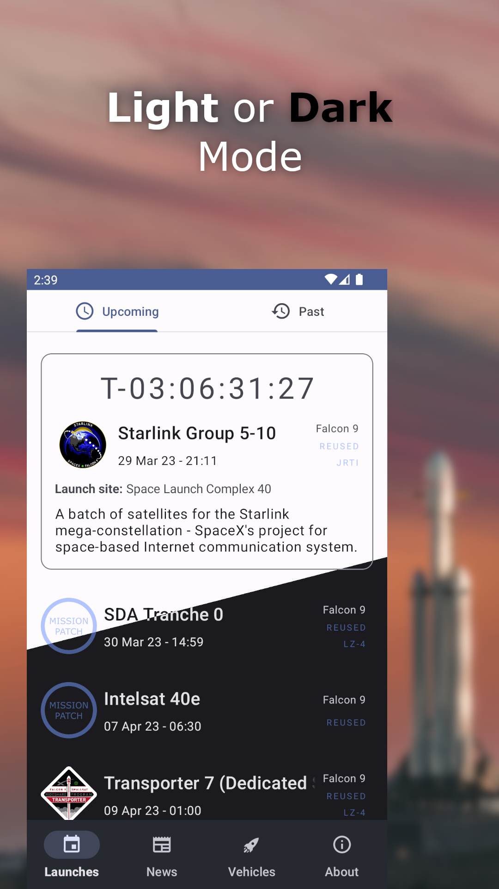
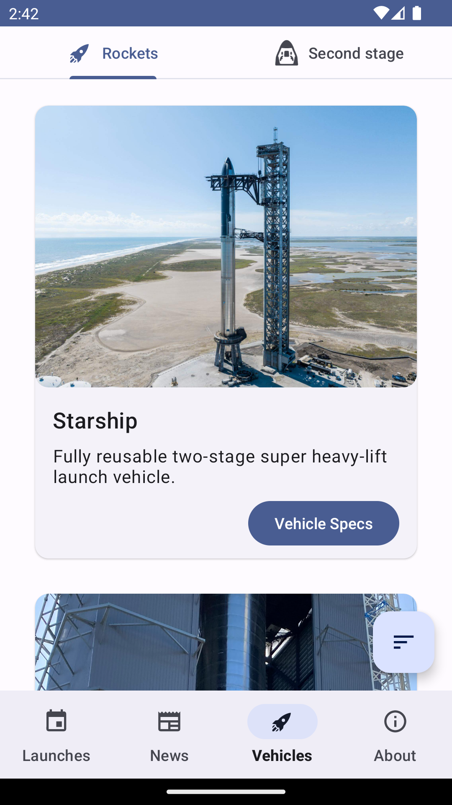

  
  
  
  
  
  

  

# SpaceX-Launch-Tracker

An unofficial SpaceX app powered by the r/SpaceX API offering a comprehensive view of the latest SpaceX data.

  
  

## Features:

- **Dashboard** - Countdown to the next launch. View the latest launches and pin your favourite.

- **Past and planned launches** - Offers extensive launch details.

- **Calendar events** - Create calendar events from within the app.

- **News** - SpaceX twitter and r/SpaceX feed.

- **Vehicles** - Catalog of all rockets and capsules built by SpaceX.

- **Statistics** - Graphs and things. Graphs are fun.

- **History and Milestones** - Get up to date with SpaceX history.
